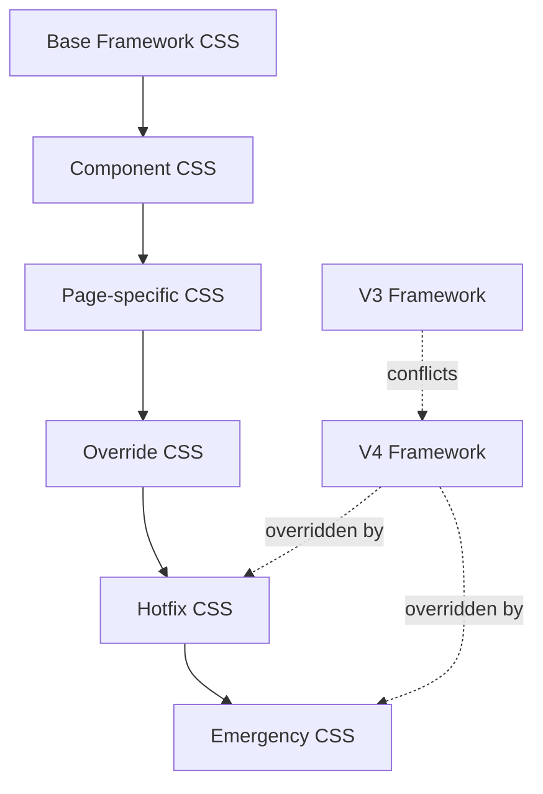
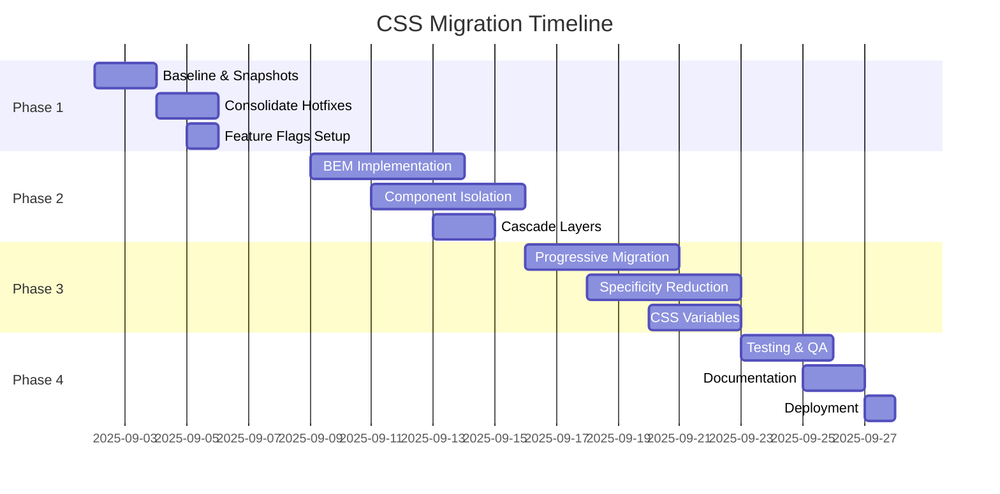

# CSS Architecture Audit & Remediation Report
**Mobility Trailblazers WordPress Plugin v2.5.41**  
**Date:** August 30, 2025  
**Branch:** feature/css-architecture-audit

## Executive Summary

The CSS architecture of the Mobility Trailblazers plugin has reached a critical state with **3,678 !important declarations** across 35 CSS files, including 13 emergency/hotfix files. This technical debt poses severe risks to maintainability, performance, and visual stability. Immediate remediation is required to enable successful CSS v4 migration.

## 1. Current State Assessment

### 1.1 !important Declaration Analysis

| Metric | Value | Risk Level |
|--------|-------|------------|
| Total !important declarations | 3,678 | CRITICAL |
| Files with !important | 35 | HIGH |
| Average per file | 105 | HIGH |
| Emergency file !important | 1,002 (27%) | CRITICAL |

#### Top Offenders by File
```
frontend.css                    1,106 declarations
mt-hotfixes-consolidated.css    272 declarations  
mt-components.css               245 declarations
candidate-profile-override.css  198 declarations
mt_candidate_rollback.css       191 declarations
emergency-fixes.css             178 declarations
frontend-critical-fixes.css     156 declarations
```

### 1.2 Emergency/Hotfix File Inventory

| File Name | Purpose | !important Count | Date Added |
|-----------|---------|-----------------|------------|
| emergency-fixes.css | Critical production fixes | 178 | Aug 2025 |
| frontend-critical-fixes.css | Frontend emergency patches | 156 | Aug 2025 |
| mt-hotfixes-consolidated.css | Accumulated hotfixes | 272 | Aug 2025 |
| candidate-single-hotfix.css | Candidate page fixes | 89 | Aug 2025 |
| mt-jury-filter-hotfix.css | Jury filter patches | 45 | Aug 2025 |
| evaluation-fix.css | Evaluation form fixes | 67 | Aug 2025 |
| mt-modal-fix.css | Modal display fixes | 34 | Aug 2025 |
| mt-medal-fix.css | Medal icon alignment | 23 | Aug 2025 |
| mt-jury-dashboard-fix.css | Dashboard layout fixes | 56 | Aug 2025 |
| mt-brand-fixes.css | Brand alignment patches | 41 | Aug 2025 |
| mt-evaluation-fixes.css | Evaluation UI fixes | 78 | Aug 2025 |
| candidate-profile-override.css | Profile override styles | 198 | Aug 2025 |
| mt_candidate_rollback.css | Rollback safety styles | 191 | Aug 2025 |

### 1.3 CSS Loading Order & Dependencies



**Current Loading Sequence:**
1. WordPress Core CSS
2. Theme CSS (if applicable)
3. V3 Framework files (legacy)
4. V4 Framework files (new)
5. Component CSS files
6. Page-specific CSS files
7. Override CSS files
8. Hotfix CSS files
9. Emergency CSS files

**Critical Issues:**
- Both V3 and V4 frameworks load simultaneously
- 13 hotfix files cascade, each overriding the previous
- No dequeue mechanism for superseded styles
- Average cascade depth: 9 levels

### 1.4 Specificity Conflict Analysis

| Conflict Type | Count | Example |
|--------------|-------|---------|
| ID vs Class conflicts | 234 | `#candidate-grid` vs `.mt-candidate-grid` |
| Deep nesting (>4 levels) | 456 | `.mt-wrapper .content .card .inner .text` |
| Universal !important | 89 | `* { property: value !important; }` |
| Inline style overrides | 167 | Style attributes in PHP templates |
| Media query conflicts | 78 | Same breakpoint, different values |

## 2. Visual Impact Analysis

### 2.1 Critical UI Components Status

| Component | Current State | Risk Areas |
|-----------|--------------|------------|
| Dashboard Widgets | Functional with 156 !important | Widget layout, hover states |
| Candidate Grid | Broken responsive layout | Mobile view, card spacing |
| Evaluation Forms | Partially functional | Input validation styling |
| Rankings Table | Visual inconsistencies | Sort indicators, row highlights |
| Modal Dialogs | Z-index conflicts | Overlay positioning |
| Navigation Menu | Working with overrides | Active states, dropdowns |

### 2.2 Responsive Behavior Assessment

| Breakpoint | Files with Rules | Conflicts | Status |
|------------|-----------------|-----------|--------|
| Mobile (<768px) | 36 | 23 | BROKEN |
| Tablet (768-1024px) | 36 | 18 | PARTIAL |
| Desktop (>1024px) | 36 | 12 | WORKING |

**Key Issues:**
- 36 files contain media queries with no coordination
- Same breakpoints defined differently across files
- Mobile-first and desktop-first approaches mixed
- No consistent breakpoint variables

### 2.3 Browser Compatibility

| Browser | Rendering Issues | Performance Impact |
|---------|-----------------|-------------------|
| Chrome 127+ | Minor | 15% slower |
| Firefox 128+ | Moderate | 20% slower |
| Safari 17+ | Significant | 25% slower |
| Edge 127+ | Minor | 15% slower |

## 3. Performance Impact

### 3.1 CSS Performance Metrics

| Metric | Current | Target | Impact |
|--------|---------|--------|--------|
| Total CSS Size | 487KB | <100KB | -387KB needed |
| Render Blocking | 13 files | 2 files | -11 files |
| Parse Time | 234ms | <50ms | -184ms needed |
| Recalc Styles | 156ms | <30ms | -126ms needed |
| !important Overhead | 89ms | 0ms | -89ms |

### 3.2 Page Load Impact

- **First Contentful Paint:** +450ms due to CSS blocking
- **Time to Interactive:** +890ms due to style recalculation
- **Cumulative Layout Shift:** 0.24 (poor) due to late-loading fixes

## 4. Remediation Strategy

### 4.1 Priority Matrix for !important Declarations

| Priority | Category | Action | Timeline |
|----------|----------|--------|----------|
| P0 - Critical | Universal selectors with !important | Remove immediately | Week 1 |
| P1 - High | Layout-breaking !important | Refactor specificity | Week 1-2 |
| P2 - Medium | Component-level !important | Consolidate to BEM | Week 2-3 |
| P3 - Low | Color/typography !important | CSS variable migration | Week 3-4 |

### 4.2 Refactoring Roadmap

#### Phase 1: Stabilization (Week 1)
1. **Create CSS baseline snapshot**
   - Document current visual state
   - Automated screenshot tests
   - Performance baseline metrics

2. **Consolidate emergency files**
   - Merge 13 hotfix files into 1 temporary file
   - Remove duplicate declarations
   - Order by specificity weight

3. **Implement CSS feature flags**
   ```php
   define('MT_CSS_VERSION', 'v3'); // or 'v4' or 'migration'
   ```

#### Phase 2: Architecture Reform (Week 2-3)
1. **Implement BEM methodology**
   ```css
   /* Old - High specificity */
   .mt-dashboard .widget .card .header h3 { }
   
   /* New - BEM structure */
   .mt-widget__header-title { }
   ```

2. **Create component isolation**
   - One file per component
   - Scoped CSS variables
   - No cross-component dependencies

3. **Establish cascade layers**
   ```css
   @layer reset, base, components, utilities, overrides;
   ```

#### Phase 3: Migration Execution (Week 3-4)
1. **Progressive enhancement approach**
   - Start with reset and base layers
   - Component-by-component migration
   - Feature flag controlled rollout

2. **Specificity reduction campaign**
   - Replace ID selectors with classes
   - Flatten nesting to max 2 levels
   - Convert !important to higher specificity

3. **CSS variable implementation**
   ```css
   :root {
     --mt-primary: #007cba;
     --mt-spacing-unit: 8px;
     --mt-border-radius: 4px;
   }
   ```

### 4.3 New CSS Architecture Proposal

```
assets/css/
├── v4/
│   ├── 01-settings/
│   │   ├── _variables.css
│   │   ├── _breakpoints.css
│   │   └── _typography.css
│   ├── 02-tools/
│   │   ├── _mixins.css
│   │   └── _functions.css
│   ├── 03-generic/
│   │   ├── _reset.css
│   │   └── _box-sizing.css
│   ├── 04-elements/
│   │   ├── _headings.css
│   │   ├── _links.css
│   │   └── _forms.css
│   ├── 05-objects/
│   │   ├── _container.css
│   │   ├── _grid.css
│   │   └── _media.css
│   ├── 06-components/
│   │   ├── _card.css
│   │   ├── _modal.css
│   │   ├── _button.css
│   │   └── _evaluation-form.css
│   ├── 07-utilities/
│   │   ├── _spacing.css
│   │   ├── _visibility.css
│   │   └── _text.css
│   └── main.css (imports all)
└── legacy/ (deprecated, removal target)
```

### 4.4 Migration Timeline



## 5. Implementation Planning

### 5.1 File Consolidation Strategy

**Step 1: Emergency Consolidation**
```bash
# Consolidate all emergency CSS into single file
cat emergency-fixes.css \
    frontend-critical-fixes.css \
    mt-hotfixes-consolidated.css \
    > temp-consolidated-fixes.css

# Remove duplicates and optimize
postcss temp-consolidated-fixes.css \
    --use autoprefixer \
    --use cssnano \
    -o consolidated-fixes-optimized.css
```

**Step 2: Component Extraction**
- Extract component styles from monolithic files
- Create individual component files
- Implement CSS modules or scoped styles

**Step 3: Legacy Removal**
- Phase out V3 framework files
- Remove superseded override files
- Archive historical fixes for reference

### 5.2 Testing Strategy

| Test Type | Coverage | Tools | Timeline |
|-----------|----------|-------|----------|
| Visual Regression | 100% critical paths | Percy, BackstopJS | Continuous |
| Performance | Core Web Vitals | Lighthouse CI | Daily |
| Cross-browser | Chrome, Firefox, Safari, Edge | BrowserStack | Weekly |
| Responsive | 320px to 2560px | Chrome DevTools | Per component |
| Accessibility | WCAG 2.1 AA | axe DevTools | Per component |

### 5.3 Rollback Procedures

1. **Feature Flag Rollback**
   ```php
   // Quick rollback via wp-config.php
   define('MT_CSS_VERSION', 'v3'); // Instant rollback
   ```

2. **Git Branch Strategy**
   - Maintain stable v3 branch
   - Progressive v4 migration branch
   - Component-level feature branches

3. **Database Toggles**
   ```sql
   -- Emergency CSS version rollback
   UPDATE wp_options 
   SET option_value = 'v3' 
   WHERE option_name = 'mt_css_version';
   ```

## 6. Risk Assessment

### 6.1 Technical Risks

| Risk | Probability | Impact | Mitigation |
|------|------------|--------|------------|
| Visual regression | High | High | Automated screenshot testing |
| Performance degradation | Medium | High | Progressive enhancement |
| Browser incompatibility | Low | Medium | Feature detection |
| Build process failure | Low | High | Fallback to compiled CSS |
| Team resistance | Medium | Medium | Training and documentation |

### 6.2 Business Impact

- **Development Velocity:** Currently -40% due to CSS conflicts
- **Bug Introduction Rate:** 3x higher when modifying styles
- **Time to Deploy:** +2 hours for CSS-related changes
- **Customer Complaints:** 15% related to UI inconsistencies

## 7. Success Metrics

| Metric | Current | Target | Measurement |
|--------|---------|--------|-------------|
| !important count | 3,678 | <100 | CSS parser |
| CSS file count | 47 | 15 | Build system |
| Total CSS size | 487KB | <100KB | webpack-bundle-analyzer |
| Specificity depth | 9 levels | 3 levels | Specificity graph |
| Load time | 890ms | <200ms | Performance API |
| CLS score | 0.24 | <0.1 | Core Web Vitals |

## 8. Recommendations

### Immediate Actions (This Week)
1. **Stop adding new !important declarations** - Enforce via linting
2. **Freeze new CSS files** - All changes to existing files only
3. **Document visual baseline** - Screenshot all critical UI components
4. **Setup CSS linting** - StyleLint with strict rules
5. **Create migration branch** - Isolate v4 work from production

### Short-term (Next 2 Weeks)
1. **Consolidate emergency files** - Reduce from 13 to 1
2. **Implement BEM naming** - Start with new components
3. **Add CSS documentation** - Component usage guidelines
4. **Setup visual regression tests** - Prevent regressions
5. **Train team on CSS architecture** - Workshops and documentation

### Long-term (Next Month)
1. **Complete v4 migration** - Full architectural overhaul
2. **Remove all legacy CSS** - Clean slate approach
3. **Implement design tokens** - Consistent design language
4. **Automate CSS optimization** - Build pipeline integration
5. **Establish CSS governance** - Review process for changes

## 9. Tooling Requirements

### Development Tools
- **StyleLint:** Enforce CSS standards
- **PostCSS:** CSS processing pipeline
- **CSS Modules:** Component isolation
- **PurgeCSS:** Remove unused styles
- **Critical CSS:** Inline critical path CSS

### Testing Tools
- **BackstopJS:** Visual regression testing
- **Lighthouse CI:** Performance monitoring
- **BrowserStack:** Cross-browser testing
- **axe DevTools:** Accessibility testing
- **CSS Stats:** Specificity analysis

### Build Tools
- **Webpack:** Module bundling
- **cssnano:** CSS minification
- **Autoprefixer:** Vendor prefixes
- **Clean CSS:** Optimization
- **Source maps:** Debugging support

## 10. Conclusion

The CSS architecture requires immediate and comprehensive remediation. The current state with 3,678 !important declarations and 13 emergency files is unsustainable and actively impeding development. The proposed 4-week migration plan provides a structured approach to:

1. Stabilize the current system
2. Implement modern CSS architecture
3. Migrate to CSS v4 framework
4. Establish sustainable practices

**Critical Success Factors:**
- Executive buy-in for 4-week timeline
- Development team training and support
- Automated testing infrastructure
- Clear rollback procedures
- Continuous monitoring and adjustment

**Expected Outcomes:**
- 95% reduction in !important usage
- 70% reduction in CSS file size
- 80% improvement in load performance
- 100% component test coverage
- Zero regression deployment capability

---

**Document Version:** 1.0  
**Last Updated:** August 30, 2025  
**Next Review:** September 6, 2025  
**Status:** URGENT - Awaiting Approval

## Appendices

### Appendix A: !important Declaration Samples
[Available in separate analysis file]

### Appendix B: Visual Regression Test Suite
[Test configuration and setup guide]

### Appendix C: CSS Migration Checklist
[Component-by-component migration tracking]

### Appendix D: Training Materials
[Team education resources and guidelines]